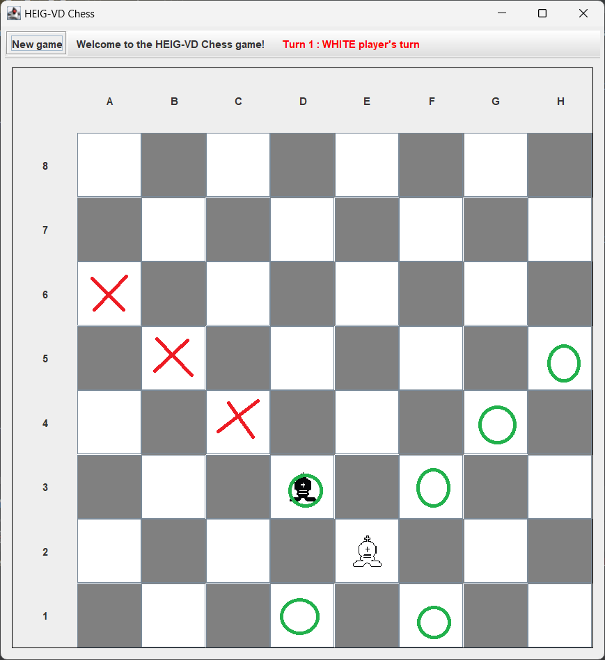

<div align="justify" style="margin-right:25px;margin-left:25px">

# Laboratoire 8 - Jeu d'échecs

Groupe : L08GrK

Étudiants : Rodrigo Lopes dos Santos, Urs Behrmann

____________________

# Modélisation UML


____________________

# Choix de conception

## Mouvement

### Fichiers et Leur Rôle

#### `Step.java`
- Définit un pas de mouvement.
- Selon le maxStep, il définie un mouvement via des les coordonnées : 
  - [Pas de mouvement, Pas de mouvement + 1 pas, Pas de mouvement + 2 pas, ...., Pas de mouvement + maxStep]
- Contient les coordonnées d'un pas, une liste de coordonnées du mouvement selon maxStep et l'angle de déplacement.
- Il est possible d'inverser l'axe x et y. Cela est intéressant pour les pièces noir car, par exemple, avancer en avant est un step de (0, -1) et non pas de (0, 1)
```java
public Step(Coordinates step, int maxStep, boolean invertOrdinateAxis, boolean invertAbscissaAxis){}

public class X extends Piece {
    public X(PlayerColor color) {
        super(PieceType.X, color, new Movements(new Step[]{
                new Step(new Coordinates(1,0), 1, color == PlayerColor.BLACK, color == PlayerColor.BLACK),
                // new Step(....), ...       
                }));
    }
}
```


#### `Movements.java`
- Gère les mouvements des pièces.
- Contient une liste de `Step` et une méthode pour obtenir `Step` possible en fonction des positions initiale et finale.


#### `Piece.java`
- Contient une méthode `Coordinates[] getPossibleMovement( ... )` qui via les `movements` et les positions initiale et finale détermine le step possible et retourne son mouvement.
- Contient une méthode `boolean movementIsOk( ... )` qui via les positions initiale, finale et `Coordinates[] getPossibleMovement( ... )` détermine le mouvement possible et cherche dans celui-ci si la position final si trouve.
  - Si oui : Le mouvement de la position initiale à finale est possible
  - Sinon : Le mouvement de la position initiale à finale est impossible


### Fonctionnement Général

Les mouvements des pièces sont gérés de manière modulaire, où chaque pièce a ses propres règles de mouvement définies dans des classes spécifiques (par exemple, `Knight.java`, `Pawn.java`). Ces classes utilisent la classe `Movements` pour gérer les déplacements possibles. La classe `Step` joue un rôle clé en définissant la nature d'un pas de mouvement, tandis que `Coordinates` est utilisée pour représenter et manipuler les positions sur le plateau.

Exemple d'utilisation:
```java
public class King extends Piece {
    public King(PlayerColor color) {
        super(PieceType.KING, color, new Movements(new Step[]{
                //Horizontal
                new Step(new Coordinates(1,0), 1, color == PlayerColor.BLACK, color == PlayerColor.BLACK),
                new Step(new Coordinates(-1,0), 1, color == PlayerColor.BLACK, color == PlayerColor.BLACK),

                //Vertical
                new Step(new Coordinates(0,1), 1, color == PlayerColor.BLACK, color == PlayerColor.BLACK),
                new Step(new Coordinates(0,-1), 1, color == PlayerColor.BLACK, color == PlayerColor.BLACK),

                //Diagonal
                new Step(new Coordinates(1,1), 1, color == PlayerColor.BLACK, color == PlayerColor.BLACK),
                new Step(new Coordinates(1,-1), 1, color == PlayerColor.BLACK, color == PlayerColor.BLACK),
                new Step(new Coordinates(-1,1), 1, color == PlayerColor.BLACK, color == PlayerColor.BLACK),
                new Step(new Coordinates(-1,-1), 1, color == PlayerColor.BLACK, color == PlayerColor.BLACK),
        }));
    }
}
```

____________________

# Tests

On a crée un GameManagerTest et un BoardTest qui peuvent lancer plusieurs scènarios de test différent :

- test pawn
- test rook
- test knight
- test queen
- test king
- test bishop
- test pawn promotion
- test check
- test checkmate
- test stalemate
- test castling

## test pawn

On a que deux pions sur le plateau pour tester le mouvement des pions et leur attack "en passant" et en diagonal.

## test rook

On a que deux tours sur le plateau pour tester le mouvement des tours et leur attack.

On peut aussi tester le mouvement des tours quand il y a des pièces entre la tour et la position finale.

## test knight

On a que deux cavaliers sur le plateau pour tester le mouvement des cavaliers et leur attack.

## test queen

On a que deux reines sur le plateau pour tester le mouvement des reines et leur attack.

On peut aussi tester le mouvement des reines quand il y a des pièces entre la reine et la position finale.

## test king

On a que deux rois sur le plateau pour tester le mouvement des rois et leur attack.

On peut aussi tester le mouvement des rois quand il y a une pièce qui peut attaquer le roi et est donc un mouvement illégal.


## test bishop

On a que deux fous sur le plateau pour tester le mouvement des fous et leur attack.

On peut aussi tester le mouvement des fous quand il y a des pièces entre le fou et la position finale.



## test pawn promotion

On a que deux pions sur le plateau pour tester la promotion des pions.

## test check

On a quelque pièces sur le plateau pour tester le "check" pour noir.


## test checkmate

On a quelque pièces sur le plateau pour tester le "checkmate" pour noir.


## test stalemate

On a quelque pièces sur le plateau pour tester le "stalemate" pour noir.


## test castling

On a les deux rois et les quatre tours sur le plateau pour tester les deux "castling" pour les deux couleurs.


</div>